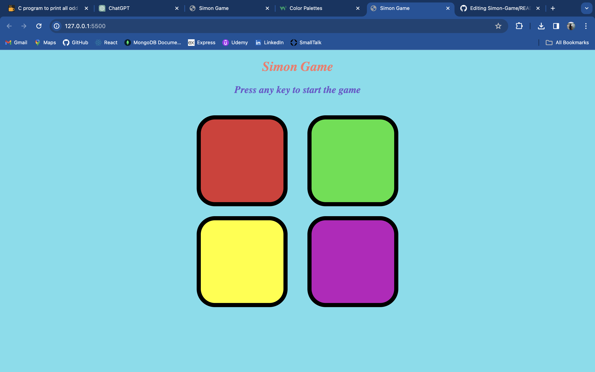

# Simon Game

A classic Simon game implementation using HTML, CSS, and JavaScript.



## Description

Simon is a memory game where players have to repeat a sequence of colors. This project is a digital version of the classic Simon game. The game starts with a sequence of colors that the player must mimic by clicking on the corresponding buttons. With each successful round, the sequence gets longer, increasing the difficulty. The game ends when the player makes a mistake in mimicking the sequence.

## Features

- Randomly generated sequences of colors for each level.
- Flashing buttons to indicate the sequence to the player.
- Interactive buttons for the player to click and mimic the sequence.
- Level tracking to indicate the player's progress.
- Game over screen with the player's final score.

## Demo

You can play the game online [here](link-to-demo).

## Installation

1. Clone the repository:

```bash
git clone https://github.com/your-username/simon-game.git
